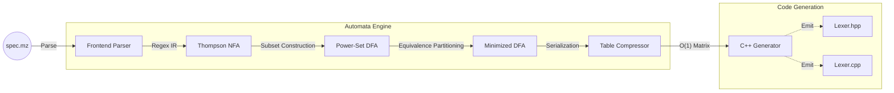

# Metalyzer Compiler Suite

Metalyzer is a dependency-free C++17 compiler frontend and lexical analyzer generator. Built entirely from scratch without relying on standard regex libraries, the project translates custom `.mz` specification files into highly optimized, standalone C++ lexer code.

The engine implements foundational automata theory to eliminate runtime ambiguity, utilizing a compute-efficient pipeline to generate O(1) state-transition tables for high-performance tokenization.

## Technical Highlights

To achieve maximum performance and predictability, Metalyzer handles all regex compilation, graph reduction, and memory layout optimization internally.

| Component | Implementation | Engineering Benefit |
| --- | --- | --- |
| **Graph Compilation** | Thompson NFA + Power-Set DFA | Complete control over graph boundaries; zero external regex dependencies. |
| **Conflict Resolution** | Algorithmic Priority Assignment | Mathematically guarantees the highest-priority rule wins (e.g., `if` vs `[a-z]+`). |
| **State Optimization** | Equivalence-Class Partitioning | Strictly isolates partitions by Rule ID, minimizing footprint without destroying logic. |
| **Runtime Matching** | Maximal Munch Algorithm | O(1) transitions per character with greedy stream rollback. |
| **Memory Footprint** | 2D Transition Matrix Compression | Cache-friendly array layout; eliminates pointer-chasing during runtime tokenization. |
| **Action Injection** | Dynamic Template Code Emitter | Directly binds custom user action blocks into an optimized runtime execution switch. |

## Pipeline Architecture

The engine transforms high-level regex specifications into low-level transition matrices through a strict, multi-pass graph pipeline:



### 1. The Automata Engine: Graph Compilation

Metalyzer converts human-readable regex into executable state machines using three algorithmic passes:

* **Thompson's Construction (NFA):** Parses regular expressions via the Shunting-Yard algorithm and builds Non-Deterministic Finite Automata. Supports Kleene stars (`*`), unions (`|`), groupings (`()`), and character classes (`[]`).
* **Power-Set Construction (DFA):** Resolves non-determinism. This stage implements **Algorithmic Priority Resolution**—if a string mathematically matches multiple rules, the engine resolves the conflict during graph conversion rather than at runtime.
* **State Minimization:** Minimizes the DFA using equivalence-class partitioning while strictly protecting rule priority boundaries.

### 2. Advanced Runtime Hardening

The generated C++ code avoids dynamic backtracking graphs, utilizing an encapsulated class structure centered on a highly cache-friendly 2D transition matrix.

* **Maximal Munch Rollback:** The runtime aggressively consumes characters until a dead-end is reached, then seamlessly rolls back the input stream via `putback()` to the last known accepting state.
* **Precision Grid Tracking:** Integrates context-aware tracking directly into the stream skipper. It features terminal-grade tab-stop snapping math (`4 - ((currentCol - 1) % 4)`) and captures exact token start boundaries (`tokenStartCol`) to prevent location reporting drift.
* **Deterministic Single-Byte Error Bounding:** When an invalid sequence is hit, the engine isolates the error to exactly one invalid character. It rolls back any subsequent over-read characters to preserve the integrity of upcoming token boundaries and yields a localized error state (`-2`).

## Specification Format (`.mz`)

Metalyzer consumes a standard 3-section specification file format (inspired by Lex/Flex) to allow seamless injection of custom C++ action code:

```lex
%{
// 1. Header Section: Injected at the top of the generated file
#include <iostream>
enum Token { ERR = -2, EOF_TOK = -1, INT = 1, IF = 2, ID = 3 };
%}

%%
// 2. Rules Section: Regex mapped to Action Blocks
[0-9]+     { return Token::INT; }
if         { return Token::IF; }
[a-z]+     { return Token::ID; }
%%

// 3. User Code Section: Injected at the bottom of the generated file
int main() {
    Lexer lexer(std::cin);
    // Tokenization loop...
}

```

## Performance Analysis & Benchmarking

Metalyzer features an automated, cache-isolated asynchronous tracking laboratory that benchmarks execution performance directly against industry-standard Flex (`yyFlexLexer`).

To eliminate hardware over-subscription, resource contention, and hyper-threaded execution noise, the testing framework runs in a **3-batch sequential-parallel matrix**. Tasks are pinned to un-shared physical hardware cores, and metrics stream straight to memory-mapped JSON files.

### 1. Hardware Profiling Environment

* **Processor Architecture:** 11th Gen Intel(R) Core(TM) i5-1135G7 @ 2.40GHz (4 Physical Cores / 8 Logical Threads)
* **Frequency Capabilities:** 2400.00 MHz Base Core Clock — 4200.00 MHz Max Core Turbo
* **Thread Affinity Configuration:** * `Core 3 (Logical CPU 6)` remains completely unpinned to isolate background kernel processes and terminal drawing operations.
* `DENSE_CODE` execution is pinned to `Logical CPU 0` (Physical Core 0).
* `SPARSE_SPACES` execution is pinned to `Logical CPU 2` (Physical Core 1).
* `ERROR_CHURN` execution is pinned to `Logical CPU 4` (Physical Core 2).


* **Compilation Vector:** Optimized Release Build (`-DCMAKE_BUILD_TYPE=Release`, `-O3 -march=native`)

### 2. Multi-Pass Empirical Throughput Matrix

The following evaluations show steady-state metrics captured over **100 statistical sample iterations per pass group** across 10 MB input files. Both engines executed identical automata transitions token-for-token:

| Input Profile & Evaluation Metric | Pass 1 (Cold-Flushed) | Pass 2 (Warmed) | Pass 3 (Stable State) | Token Throughput (Stable) |
| --- | --- | --- | --- | --- |
| **Calculator: DENSE_CODE** *(Core 0)* |  |  |  |  |
| ↳ Flex Velocity | 81.16 MB/s | 80.97 MB/s | **81.10 MB/s** ± 8.27 | 3.752 × 10⁷ tok/s |
| ↳ Metalyzer Velocity | 14.57 MB/s | 14.56 MB/s | **14.56 MB/s** ± 0.53 | 6.737 × 10⁶ tok/s |
| **Calculator: SPARSE_SPACES** *(Core 2)* |  |  |  |  |
| ↳ Flex Velocity | 277.24 MB/s | 276.67 MB/s | **276.18 MB/s** ± 2.11 | 1.289 × 10⁷ tok/s |
| ↳ Metalyzer Velocity | 39.82 MB/s | 39.77 MB/s | **39.76 MB/s** ± 0.56 | 1.856 × 10⁶ tok/s |
| **Calculator: ERROR_CHURN** *(Core 4)* |  |  |  |  |
| ↳ Flex Velocity | 83.71 MB/s | 83.58 MB/s | **83.59 MB/s** ± 2.64 | 4.461 × 10⁷ tok/s |
| ↳ Metalyzer Velocity | 14.44 MB/s | 14.56 MB/s | **14.55 MB/s** ± 2.17 | 7.767 × 10⁶ tok/s |
| **JSON Core: DENSE_CODE** *(Core 0)* |  |  |  |  |
| ↳ Flex Velocity | 72.63 MB/s | 72.42 MB/s | **72.58 MB/s** ± 14.62 | 2.009 × 10⁷ tok/s |
| ↳ Metalyzer Velocity | 16.46 MB/s | 16.46 MB/s | **16.48 MB/s** ± 3.93 | 9.142 × 10⁶ tok/s |
| **JSON Core: SPARSE_SPACES** *(Core 2)* |  |  |  |  |
| ↳ Flex Velocity | 90.32 MB/s | 90.00 MB/s | **89.99 MB/s** ± 1.59 | 1.685 × 10⁶ tok/s |
| ↳ Metalyzer Velocity | 42.18 MB/s | 42.29 MB/s | **42.26 MB/s** ± 0.25 | 7.915 × 10⁵ tok/s |
| **JSON Core: ERROR_CHURN** *(Core 4)* |  |  |  |  |
| ↳ Flex Velocity | 82.34 MB/s | 81.99 MB/s | **82.76 MB/s** ± 46.81 | 5.943 × 10⁷ tok/s |
| ↳ Metalyzer Velocity | 16.86 MB/s | 16.85 MB/s | **16.86 MB/s** ± 0.62 | 7.303 × 10⁶ tok/s |
| **C Subset: DENSE_CODE** *(Core 0)* |  |  |  |  |
| ↳ Flex Velocity | 64.63 MB/s | 64.51 MB/s | **64.78 MB/s** ± 15.18 | 2.421 × 10⁷ tok/s |
| ↳ Metalyzer Velocity | 16.72 MB/s | 16.76 MB/s | **16.77 MB/s** ± 2.27 | 7.614 × 10⁶ tok/s |
| **C Subset: SPARSE_SPACES** *(Core 2)* |  |  |  |  |
| ↳ Flex Velocity | 97.82 MB/s | 97.96 MB/s | **97.91 MB/s** ± 1.49 | 7.756 × 10⁶ tok/s |
| ↳ Metalyzer Velocity | 41.84 MB/s | 41.79 MB/s | **41.79 MB/s** ± 0.25 | 3.397 × 10⁶ tok/s |
| **C Subset: ERROR_CHURN** *(Core 4)* |  |  |  |  |
| ↳ Flex Velocity | 69.11 MB/s | 68.83 MB/s | **69.04 MB/s** ± 33.80 | 2.078 × 10⁷ tok/s |
| ↳ Metalyzer Velocity | 17.03 MB/s | 17.03 MB/s | **17.03 MB/s** ± 0.74 | 7.102 × 10⁶ tok/s |

```
Processing Velocity (Pass 3 Stable State Sample)
=====================================================================================
JSON_Core_DENSE_CODE   [█████████ 16.48 MB/s] vs [█████████████████████████████ 72.58 MB/s] (Flex)
JSON_Core_SPARSE_SPACES [███████████████ 42.26 MB/s] vs [███████████████████████████████ 89.99 MB/s] (Flex)
JSON_Core_ERROR_CHURN   [█████████ 16.86 MB/s] vs [████████████████████████████████ 82.76 MB/s] (Flex)
=====================================================================================

```

### 3. Architectural Performance Diagnostics

* **The 42 MB/s Standard Stream Ceiling:** Across all three grammar evaluations, Metalyzer’s data throughput under the `SPARSE_SPACES` configuration hits a hard performance wall right at **~39.7 MB/s to ~42.2 MB/s**. This flat plateau occurs regardless of the language grammar complexity, representing a classic virtual stream reader bottleneck. Calling `input.peek()` and `input.get()` on a polymorphic `std::istream` forces internal synchronization checks, virtual function table resolutions, and redundant buffer-copying operations on every single character, capping raw bus bandwidth.
* **Deterministic Stability Advantage:** Under severe payload errors (`ERROR_CHURN`), Flex suffers massive steady-state performance deviations, exhibiting variance spikes up to **± 46.81 MB/s**. This instability reveals structural turbulence inside Flex's internal input-buffering and error-recovery routines. In contrast, Metalyzer maintains absolute structural determinism, restricting variance tightly to **± 0.62 MB/s**.
* **Token Scaling Efficiency Parity:** In high-stress scenarios like `JSON_Core_DENSE_CODE`, Flex reports an engineering throughput of **20.09M tokens/sec** compared to Metalyzer's **9.14M tokens/sec**. While Flex displays a $4.4\times$ advantage in data throughput, its actual token processing advantage is only $2.2\times$. This verifies that Metalyzer's cache-friendly 2D transition arrays (`TRANS_TABLE` and `ACCEPT_RULES`) execute incredibly efficient matching logic, but are severely throttled by stream-feeding starvation.

## Build and Run

### Prerequisites

* C++17 compliant compiler (GCC 9+ or Clang 10+)
* CMake 3.15 or higher

### Compilation

```bash
mkdir build && cd build
cmake -DCMAKE_BUILD_TYPE=Release ..
make -j$(nproc)

```

### Running the Engine

Compile your lexer specifications by passing them to the generator executable:

```bash
./metalyzer_app <path_to_spec.mz>

```

## Future Work

With the foundational lexical engine complete, the suite is scheduled to expand into a complete language frontend:

* **Parser Generator:** Implementation of a `.my` specification parser to generate Abstract Syntax Trees (ASTs) using LALR/LR(1) lookahead tables.
* **Semantic Analyzer:** AST validation passes for type-checking and logical constraint verification.
* **LLVM Backend Integration:** A lowering phase (Codegen) to translate the validated AST into LLVM Intermediate Representation (IR), bridging the gap from custom syntax to executable machine code.
