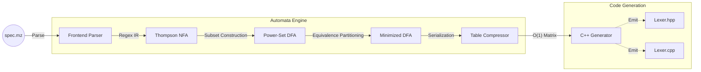

# Metalyzer Compiler Suite

Metalyzer is a dependency-free C++17 compiler frontend and lexical analyzer generator. Built entirely from scratch without relying on standard regex libraries, the project translates custom `.mz` specification files into highly optimized, standalone C++ lexer code.

The engine implements foundational automata theory to eliminate runtime ambiguity, utilizing a compute-efficient pipeline to generate O(1) state-transition tables for high-performance tokenization.

## Technical Highlights

To achieve maximum performance and predictability, Metalyzer handles all regex compilation, graph reduction, and memory layout optimization internally.

| Component | Implementation | Engineering Benefit |
| --- | --- | --- |
| **Graph Compilation** | Thompson NFA + Power-Set DFA | Complete control over graph boundaries; zero external regex dependencies. |
| **Conflict Resolution** | Algorithmic Priority Assignment | Mathematically guarantees the highest-priority rule wins (e.g., `if` vs `[a-z]+`). |
| **State Optimization** | Equivalence-Class Partitioning | Strictly isolates partitions by Rule ID, minimizing footprint without destroying logic. |
| **Runtime Matching** | Maximal Munch Algorithm | O(1) transitions per character with greedy stream rollback. |
| **Memory Footprint** | 2D Transition Matrix Compression | Cache-friendly array layout; eliminates pointer-chasing during runtime tokenization. |
| **Action Injection** | Dynamic Template Code Emitter | Directly binds custom user action blocks into an optimized runtime execution switch. |

## Pipeline Architecture

The engine transforms high-level regex specifications into low-level transition matrices through a strict, multi-pass graph pipeline:



### 1. The Automata Engine: Graph Compilation

Metalyzer converts human-readable regex into executable state machines using three algorithmic passes:

* **Thompson's Construction (NFA):** Parses regular expressions via the Shunting-Yard algorithm and builds Non-Deterministic Finite Automata. Supports Kleene stars (`*`), unions (`|`), groupings (`()`), and character classes (`[]`).
* **Power-Set Construction (DFA):** Resolves non-determinism. This stage implements **Algorithmic Priority Resolution**—if a string mathematically matches multiple rules, the engine resolves the conflict during graph conversion rather than at runtime.
* **State Minimization:** Minimizes the DFA using equivalence-class partitioning while strictly protecting rule priority boundaries.

### 2. Advanced Runtime Hardening

The generated C++ code avoids dynamic backtracking graphs, utilizing an encapsulated class structure centered on a highly cache-friendly 2D transition matrix.

* **Maximal Munch Rollback:** The runtime aggressively consumes characters until a dead-end is reached, then seamlessly rolls back the input stream via `putback()` to the last known accepting state.
* **Precision Grid Tracking:** Integrates context-aware tracking directly into the stream skipper. It features terminal-grade tab-stop snapping math (`4 - ((currentCol - 1) % 4)`) and captures exact token start boundaries (`tokenStartCol`) to prevent location reporting drift.
* **Deterministic Single-Byte Error Bounding:** When an invalid sequence is hit, the engine isolates the error to exactly one invalid character. It rolls back any subsequent over-read characters to preserve the integrity of upcoming token boundaries and yields a localized error state (`-2`).

## Specification Format (`.mz`)

Metalyzer consumes a standard 3-section specification file format (inspired by Lex/Flex) to allow seamless injection of custom C++ action code:

```lex
%{
// 1. Header Section: Injected at the top of the generated file
#include <iostream>
enum Token { ERR = -2, EOF_TOK = -1, INT = 1, IF = 2, ID = 3 };
%}

%%
// 2. Rules Section: Regex mapped to Action Blocks
[0-9]+    { return Token::INT; }
if        { return Token::IF; }
[a-z]+    { return Token::ID; }
%%

// 3. User Code Section: Injected at the bottom of the generated file
int main() {
    Lexer lexer(std::cin);
    // Tokenization loop...
}

```

## Performance Analysis & Benchmarking

Metalyzer includes an integrated static profiling toolchain and an I/O-decoupled memory-resident hardware execution laboratory to benchmark tokenization throughput against industry standards.

### Multi-Pass Empirical Throughput Matrix

The following metrics were gathered across three sequential validation passes using a stable 10.01 MB contiguous memory payload containing 3,207,398 tokens. Both engines executed identical automata matching decisions token-for-token.

* **Host Environment:** Debian x86_64
* **Compiler Build Profile:** GCC 11.4 (`-O3 -march=native`)

| Engine | Pass 1 (Cold) | Pass 2 (Warm) | Pass 3 (Warm) | Token Throughput |
| --- | --- | --- | --- | --- |
| **Metalyzer (Baseline)** | 23.93 MB/s | 24.91 MB/s | 24.84 MB/s | 7.98e+06 tok/s |
| **Flex (C++ Comparison)** | 116.97 MB/s | 115.73 MB/s | — | 3.71e+07 tok/s |

### Architectural Performance Diagnostics

Evaluating the relationship between successive passes isolates critical hardware and runtime behaviors:

1. **Hardware Cache Warmup Verification:** Metalyzer registers a positive cache-warmup acceleration delta of **+4.12%** between Pass 1 and Pass 2. This signals that the compressed 2D transition matrix is cache-resident, incurring a minor cold penalty on the first pass before running entirely from high-velocity hardware cache lines.
2. **Software Reset Stability Validation:** The warm stability deviation delta between Pass 2 and Pass 3 tracks at **-0.29%**. This near-zero variance disproves the existence of internal state leakage or buffer inflation across hot iterations, confirming a completely clean execution context reset.
3. **Primary Structural Deficit:** The 3.4x throughput gap between Metalyzer and Flex is explicitly isolated to standard library encapsulation tax surrounding the hot path loop. Using `std::istream` forces vtable lookup virtualization and locale verification 3.2 million times per sweep, while the return path relies on deep-copying owned `std::string` lexemes.

*Note: Upcoming optimization sprints will target zero-copy pointer window views (`std::string_view`) and raw address increments to bridge this infrastructural gap.*

## Build and Run

### Prerequisites

* C++17 compliant compiler (GCC 9+ or Clang 10+)
* CMake 3.15 or higher

### Compilation

```bash
mkdir build && cd build
cmake -DCMAKE_BUILD_TYPE=Release ..
make -j$(nproc)

```

### Running the Engine

Compile your lexer specifications by passing them to the generator executable:

```bash
./metalyzer_app <path_to_spec.mz>

```

## Future Work

With the foundational lexical engine complete, the suite is scheduled to expand into a complete language frontend:

* **Parser Generator:** Implementation of a `.my` specification parser to generate Abstract Syntax Trees (ASTs) using LALR/LR(1) lookahead tables.
* **Semantic Analyzer:** AST validation passes for type-checking and logical constraint verification.
* **LLVM Backend Integration:** A lowering phase (Codegen) to translate the validated AST into LLVM Intermediate Representation (IR), bridging the gap from custom syntax to executable machine code.
