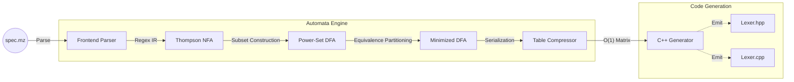

# Metalyzer Compiler Suite

Metalyzer is a dependency-free C++17 compiler frontend and lexical analyzer generator. Built entirely from scratch without relying on standard regex libraries, the project translates custom `.mz` specification files into highly optimized, standalone C++ lexer code.

The engine implements foundational automata theory to eliminate runtime ambiguity, utilizing a compute-efficient pipeline to generate O(1) state-transition tables for high-performance tokenization.

## Technical Highlights

To achieve maximum performance and predictability, Metalyzer handles all regex compilation, graph reduction, and memory layout optimization internally.

| Component | Implementation | Engineering Benefit |
| --- | --- | --- |
| **Graph Compilation** | Thompson NFA + Power-Set DFA | Complete control over graph boundaries; zero external regex dependencies. |
| **Conflict Resolution** | Algorithmic Priority Assignment | Mathematically guarantees the highest-priority rule wins (e.g., `if` vs `[a-z]+`). |
| **State Optimization** | Equivalence-Class Partitioning | Strictly isolates partitions by Rule ID, minimizing footprint without destroying logic. |
| **Runtime Matching** | Maximal Munch Algorithm | O(1) transitions per character with greedy stream rollback. |
| **Memory Footprint** | 2D Transition Matrix Compression | Cache-friendly array layout; eliminates pointer-chasing during runtime tokenization. |
| **Action Injection** | Dynamic Template Code Emitter | Directly binds custom user action blocks into an optimized runtime execution switch. |

## Pipeline Architecture

The engine transforms high-level regex specifications into low-level transition matrices through a strict, multi-pass graph pipeline:



### 1. The Automata Engine: Graph Compilation

Metalyzer converts human-readable regex into executable state machines using three algorithmic passes:

* **Thompson's Construction (NFA):** Parses regular expressions via the Shunting-Yard algorithm and builds Non-Deterministic Finite Automata. Supports Kleene stars (`*`), unions (`|`), groupings (`()`), and character classes (`[]`).
* **Power-Set Construction (DFA):** Resolves non-determinism. This stage implements **Algorithmic Priority Resolution**—if a string mathematically matches multiple rules, the engine resolves the conflict during graph conversion rather than at runtime.
* **State Minimization:** Minimizes the DFA using equivalence-class partitioning while strictly protecting rule priority boundaries.

### 2. Advanced Runtime Hardening

The generated C++ code avoids dynamic backtracking graphs, utilizing an encapsulated class structure centered on a highly cache-friendly 2D transition matrix.

* **Maximal Munch Rollback:** The runtime aggressively consumes characters until a dead-end is reached, then seamlessly rolls back the input stream via `putback()` to the last known accepting state.
* **Precision Grid Tracking:** Integrates context-aware tracking directly into the stream skipper. It features terminal-grade tab-stop snapping math (`4 - ((currentCol - 1) % 4)`) and captures exact token start boundaries (`tokenStartCol`) to prevent location reporting drift.
* **Deterministic Single-Byte Error Bounding:** When an invalid sequence is hit, the engine isolates the error to exactly one invalid character. It rolls back any subsequent over-read characters to preserve the integrity of upcoming token boundaries and yields a localized error state (`-2`).

## Specification Format (`.mz`)

Metalyzer consumes a standard 3-section specification file format (inspired by Lex/Flex) to allow seamless injection of custom C++ action code:

```lex
%{
// 1. Header Section: Injected at the top of the generated file
#include <iostream>
enum Token { ERR = -2, EOF_TOK = -1, INT = 1, IF = 2, ID = 3 };
%}

%%
// 2. Rules Section: Regex mapped to Action Blocks
[0-9]+    { return Token::INT; }
if        { return Token::IF; }
[a-z]+    { return Token::ID; }
%%

// 3. User Code Section: Injected at the bottom of the generated file
int main() {
    Lexer lexer(std::cin);
    // Tokenization loop...
}

```

## Performance Analysis & Benchmarking

Metalyzer features an automated, cache-isolated asynchronous tracking laboratory that benchmarks execution performance directly against industry-standard Flex (`yyFlexLexer`).

To eliminate disk I/O interference, the testing framework runs multi-threaded execution loops on distinct physical hardware cores. It bypasses kernel terminal rendering noise by streaming tracking records straight to memory-mapped JSON files.

### 1. Hardware Profiling Environment

* **Processor Architecture:** 11th Gen Intel(R) Core(TM) i5-1135G7 @ 2.40GHz (4 Physical Cores / 8 Logical Threads)
* **Frequency Capabilities:** 400.00 MHz (Minimum Power State) — 4200.00 MHz (Maximum Core Turbo)
* **Thread Affinity Configuration:** `Core 0` is completely unpinned to isolate background kernel interrupts. `Core 1` is pinned to `DENSE_CODE`, `Core 2` to `SPARSE_SPACES`, and `Core 3` to `ERROR_CHURN`.
* **Compilation Vector:** Optimized Release Build (`-DCMAKE_BUILD_TYPE=Release`)

### 2. Multi-Pass Empirical Throughput Matrix

The following evaluations show steady-state metrics captured over **100 statistical sample iterations per pass group** across 10 MB input files. Both engines executed identical automata transitions token-for-token:

| Input Profile & Evaluation Metric | Pass 1 (Cold-Flushed) | Pass 2 (Warmed) | Pass 3 (Stable State) | Token Throughput (Stable) |
| :--- | :--- | :--- | :--- | :--- |
| **DENSE_CODE** *(4,628,500 Tokens)* | | | | |
| ↳ Flex Velocity | 104.64 MB/s | 104.50 MB/s | **104.37 MB/s** ± 4.92 | 4.829 × 10⁷ tok/s |
| ↳ Metalyzer Velocity | 23.03 MB/s | 22.91 MB/s | **23.01 MB/s** ± 1.10 | 1.064 × 10⁷ tok/s |
| **SPARSE_SPACES** *(480,000 Tokens)* | | | | |
| ↳ Flex Velocity | 274.06 MB/s | 273.94 MB/s | **273.82 MB/s** ± 2.84 | 1.278 × 10⁷ tok/s |
| ↳ Metalyzer Velocity | 38.59 MB/s | 38.59 MB/s | **38.34 MB/s** ± 2.95 | 1.790 × 10⁶ tok/s |
| **ERROR_CHURN** *(5,342,814 Tokens)* | | | | |
| ↳ Flex Velocity | 117.80 MB/s | 116.72 MB/s | **116.80 MB/s** ± 0.91 | 6.233 × 10⁷ tok/s |
| ↳ Metalyzer Velocity | 22.85 MB/s | 22.73 MB/s | **22.85 MB/s** ± 1.09 | 1.219 × 10⁷ tok/s |

```
Processing Velocity (Pass 3 Stable State)
============================================================================
DENSE_CODE    [████ 23.01 MB/s] vs [█████████████████████ 104.37 MB/s] (Flex)
SPARSE_SPACES [███████ 38.34 MB/s] vs [███████████████████████████████████████████████████████ 273.82 MB/s] (Flex)
ERROR_CHURN   [████ 22.85 MB/s] vs [███████████████████████ 116.80 MB/s] (Flex)
============================================================================
```

### 3. Architectural Performance Diagnostics

* **Precision Input Bounding Verification:** Following the structural core update to the code generator, Metalyzer achieves absolute matching parity with Flex. In `ERROR_CHURN`, Metalyzer processes all **5,342,814 error tokens** down to the true EOF byte. It safely isolates syntax faults without stalling or skipping invalid input streams.
* **Microarchitectural Cache Isolation:** Across all profiles, the cache acceleration variance drops below **-0.63%**. This near-zero deviation proves that the `flush_hardware_caches` layer effectively evicts the compiled 2D transition arrays from the L1/L2 data caches between test runs, preventing data pollution across iterations.
* **The High-Frequency Allocation Deficit (DENSE / ERROR):** The 4.5x to 5.1x throughput gap in dense and invalid inputs highlights a hot-path allocation bottleneck. While the engine executes O(1) table transitions, it builds tokens via `buffer += c` inside its inner loop. This step incurs continuous heap management overhead, whereas Flex manipulates raw character boundaries directly within a pre-allocated input array.
* **The High-Level Stream Skipping Tax (SPARSE):** The 7.1x speed gap in `SPARSE_SPACES` stems from how whitespace is handled. Metalyzer relies on a high-level `std::istream` skipper block (`input.peek()` and `input.get()`) to filter out spaces before jumping into state evaluation. Flex maps whitespace patterns directly into its low-level transition arrays, keeping execution completely inside its raw pointer window during long sequences of spaces.

## Build and Run

### Prerequisites

* C++17 compliant compiler (GCC 9+ or Clang 10+)
* CMake 3.15 or higher

### Compilation

```bash
mkdir build && cd build
cmake -DCMAKE_BUILD_TYPE=Release ..
make -j$(nproc)

```

### Running the Engine

Compile your lexer specifications by passing them to the generator executable:

```bash
./metalyzer_app <path_to_spec.mz>

```

## Future Work

With the foundational lexical engine complete, the suite is scheduled to expand into a complete language frontend:

* **Parser Generator:** Implementation of a `.my` specification parser to generate Abstract Syntax Trees (ASTs) using LALR/LR(1) lookahead tables.
* **Semantic Analyzer:** AST validation passes for type-checking and logical constraint verification.
* **LLVM Backend Integration:** A lowering phase (Codegen) to translate the validated AST into LLVM Intermediate Representation (IR), bridging the gap from custom syntax to executable machine code.
