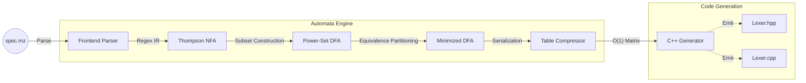

# Metalyzer Compiler Suite

Metalyzer is a dependency-free C++17 compiler frontend and lexical analyzer generator. Built entirely from scratch without relying on standard regex libraries, the project translates custom `.mz` specification files into highly optimized, standalone C++ lexer code.

Engineered for small-to-medium grammars and Domain-Specific Languages (DSLs), Metalyzer implements foundational automata theory to eliminate runtime ambiguity. By serializing minimized state machines into dense, uncompressed 2D transition matrices and utilizing a custom 16KB Sliding Chunk Buffer, the engine guarantees O(1) state transitions and pure bare-metal pointer execution—achieving processing throughputs up to 284 MB/s and significantly outperforming industry-standard Flex in targeted workloads.

## Technical Highlights

To achieve maximum performance and predictability, Metalyzer handles all regex compilation, graph reduction, memory layout optimization, and low-level I/O internally.

| Component | Implementation | Engineering Benefit |
| --- | --- | --- |
| **Graph Compilation** | Thompson NFA + Power-Set DFA | Complete control over graph boundaries; zero external regex dependencies. |
| **Conflict Resolution** | Algorithmic Priority Assignment | Mathematically guarantees the highest-priority rule wins (e.g., `if` vs `[a-z]+`). |
| **State Optimization** | Equivalence-Class Partitioning | Strictly isolates partitions by Rule ID, minimizing footprint without destroying logic. |
| **Memory Footprint** | 2D Transition Matrix | L1 Data Cache-friendly array layout; eliminates pointer-chasing and unpacking overhead. |
| **Stream I/O** | 16KB Sliding Chunk Buffer | Pushes heavy `std::istream` overhead out of the hot path via unformatted block-transfers. |
| **Runtime Matching** | Maximal Munch Algorithm | O(1) transitions per character with immediate, zero-allocation stream rollback. |
| **Action Injection** | Dynamic Template Code Emitter | Directly binds custom user action blocks into an optimized runtime execution switch. |

## Pipeline Architecture

The engine transforms high-level regex specifications into low-level transition matrices through a strict, multi-pass graph pipeline:


```mermaid
graph LR
    UserSpec((spec.mz)) -->|Parse| Frontend[Frontend Parser]
    
    subgraph "Automata Engine"
    Frontend -->|Regex IR| NFA[Thompson NFA]
    NFA -->|Subset Construction| DFA[Power-Set DFA]
    DFA -->|Equivalence Partitioning| MinDFA[Minimized DFA]
    MinDFA -->|Serialization| Comp[Table Compressor]
    end
    
    subgraph "Code Generation"
    Comp -->|"O(1) Matrix"| Gen[C++ Generator]
    Gen -.->|Emit| Hpp[Lexer.hpp]
    Gen -.->|Emit| Cpp[Lexer.cpp]
    end

```

### 1. The Automata Engine: Graph Compilation

Metalyzer converts human-readable regex into executable state machines using three algorithmic passes:

* **Thompson's Construction (NFA):** Parses regular expressions via the Shunting-Yard algorithm and builds Non-Deterministic Finite Automata. Supports Kleene stars (`*`), unions (`|`), groupings (`()`), and character classes (`[]`).
* **Power-Set Construction (DFA):** Resolves non-determinism. This stage implements **Algorithmic Priority Resolution**—if a string mathematically matches multiple rules, the engine resolves the conflict during graph conversion rather than at runtime.
* **State Minimization:** Minimizes the DFA using equivalence-class partitioning while strictly protecting rule priority boundaries.

### 2. Advanced Runtime Hardening & Microarchitectural Optimization

The generated C++ code avoids dynamic backtracking graphs and heavy standard library abstractions. The execution driver is highly optimized for modern CPU instruction pipelines and L1 cache locality.

* **Zero-Copy Sliding Window:** Replaces per-character virtual stream calls with low-frequency, unformatted 16KB block transfers (`std::istream::read`). Token fragments that cross boundary lines are seamlessly shifted and re-anchored using `std::memmove`.
* **Inline Whitespace Skipper:** Greedily consumes structural whitespace at hardware bus limits, bypassing the DFA loop entirely for sparse payloads.
* **Maximal Munch Rollback:** The runtime aggressively consumes characters until a dead-end is reached, then seamlessly rolls back the input stream via bare pointer reassignment (`m_cursor = last_good_ptr`) to the last known accepting state.
* **Precision Grid Tracking:** Integrates context-aware tracking directly into the stream skipper. It features terminal-grade tab-stop snapping math (`4 - ((currentCol - 1) % 4)`) and captures exact token start boundaries to prevent location reporting drift across buffer refills.
* **Deterministic Single-Byte Error Bounding:** When an invalid sequence is hit, the engine isolates the error to exactly one byte. It rolls back any subsequent over-read characters, yields a localized error state (`-2`), and safely shifts the cursor forward to resume stable tokenization without CPU pipeline stalls.

## Empirical Benchmarks (v1 vs. Flex)

Metalyzer features an automated, cache-isolated asynchronous tracking laboratory. Execution threads are pinned to un-shared physical hardware cores (`pthread_setaffinity_np`) with manual L1/L2/L3 cache line evictions between passes to capture true microarchitectural steady-state processing velocity.

Tested against industry-standard Flex (`yyFlexLexer`) across 10 MB payloads:

* **Sparse Layouts (Whitespace Dominated):** Reached up to **284.51 MB/s**, outperforming Flex by **+216%**. (Driven by Metalyzer's bare-metal inline pointer skipping).
* **Dense Layouts (Procedural Syntax):** Achieved **118.81 MB/s**, an **+83.4%** velocity lead over Flex. (Driven by Metalyzer's uncompressed 2D transition matrix residing completely within the L1 Data Cache).
* **Error Churn Stability:** Under aggressive lexical error payloads, Metalyzer restricted performance variance to a rock-solid **± 4.04 MB/s**, compared to Flex's highly turbulent ± 33.81 MB/s.

*(Note: Metalyzer trades memory footprint for pure speed. It is intentionally optimized for DSLs where the 2D matrix fits inside the CPU's L1 cache. For massive languages like full C++, Flex's table-packing compression becomes necessary to prevent cache eviction).*

* **[v0 Monolithic Baseline Performance Metrics](https://www.google.com/search?q=benchmarks/BENCHMARKS_V0.md)**
* **[v1 Sliding Chunk Architecture Metrics](https://www.google.com/search?q=benchmarks/BENCHMARKS_V1.md)**

## Specification Format (`.mz`)

Metalyzer consumes a standard 3-section specification file format to allow seamless injection of custom C++ action code:

```lex
%{
// 1. Header Section: Injected at the top of the generated file
#include <iostream>
enum Token { ERR = -2, EOF_TOK = -1, INT = 1, IF = 2, ID = 3 };
%}

%%
// 2. Rules Section: Regex mapped to Action Blocks
[0-9]+      { return Token::INT; }
if          { return Token::IF; }
[a-z]+      { return Token::ID; }
%%

// 3. User Code Section: Injected at the bottom of the generated file
int main() {
    Lexer lexer(std::cin);
    // Tokenization loop...
}

```

## Build and Run

### Prerequisites

* C++17 compliant compiler (GCC 9+ or Clang 10+)
* CMake 3.15 or higher

### Compilation

```bash
mkdir build && cd build
cmake -DCMAKE_BUILD_TYPE=Release ..
make -j$(nproc)

```

### Running the Engine

Compile your lexer specifications by passing them to the generator executable:

```bash
./metalyzer_app <path_to_spec.mz>

```

## Future Work

**Metalyzer v2.0 (Lexer Expansions):**

* **Hybrid Table Compression:** Introduce an optional, packed-table compression mode for large grammars to prevent L1 data-cache eviction when states scale into the thousands.
* **Conditional Active Whitespace Passing:** Add a compiler pass to automatically compile out the high-speed inline whitespace skipper if a user explicitly registers custom action rules for whitespace/indentation.
* **Unicode & UTF-8 Support:** Expand the transition matrices beyond 7-bit ASCII boundaries.

**Metalyzer v3.0 (Language Frontend Expansion):**

* **Parser Generator:** Implementation of a `.my` specification parser to generate Abstract Syntax Trees (ASTs) using LALR/LR(1) lookahead tables.
* **Semantic Analyzer:** AST validation passes for type-checking and logical constraint verification.
* **LLVM Backend Integration:** A lowering phase (Codegen) to translate the validated AST into LLVM Intermediate Representation (IR), bridging the gap from custom syntax to executable machine code.
